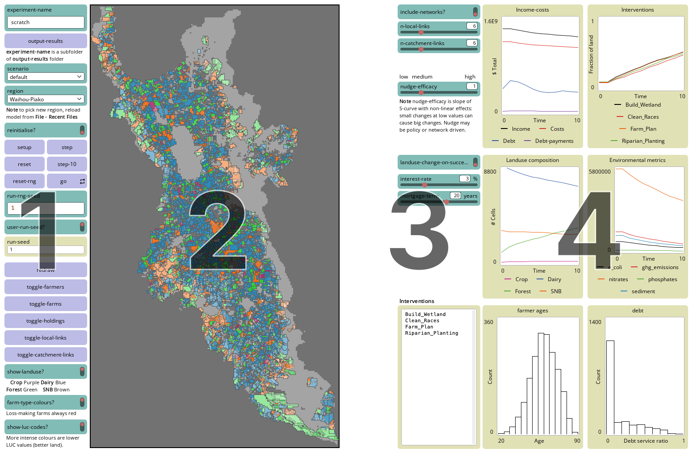

## The model interface
The easiest place to start is with an overview of what the model looks like. At time of writing (May 2026) the GUI appears as below (click on the image for a closer look):

### 1. Initialise and run model
Controls on the left-hand side are primarily selecting the scenario and/or region, starting and resetting the model, and controlling display of visual elements.

### 2. Map display
The map area shows the modelled catchment, with land use capability (LUC; more intense colours are better land) and [land use](#land-use) encoded according to the following key:

+ [**Greens**]{style='color:green;'} Forest
+ [**Blues**]{style='color:dodgerblue;'} Dairy
+ [**Oranges**]{style='color:darkorange'} Sheep and beef (SNB)
+ [**Magentas**]{style='color:magenta'} Crops

Also shown are various model _agents_:

[Farms](#farms) are delineated in black and their current profit is shown by a circle scaled by the level of profit. If 'in the black' the circle is coloured to match dominant land use on the farm. If the farm is losing money ('in the red') the circle is coloured red. If profit is zero then the circle is replaced with a small 'x'. This happens when an indebted farm has to apply all of gross profits to servicing debt.

[Holdings](#holdings) are delineated in grey and shown by squares scaled and coloured in the same way as farms.

[Farmers](#farmers) are shown as 'person' icons, coloured black where the farmer is a long-time family-owner (i.e. the farm has been inherited), or yellow if the farmer did not inherit the farm.

### 3. Model parameters
Most model parameters are included in a set of files (described on [this page](02-model-files.qmd)). Controls immediately to the right of the map area are as follows:

+ `include-networks?`, `n-local-links`, and `n-catchment-links` determine if the network connections of farmers influence their decisions concerning adoption of management interventions, and if so how large are those networks.
+ `nudge-efficacy` controls how influential are the choices of other farmers, or policy interventions on farmer decisions. It can be thought of as a measure of farmer 'suggestibility'.
+ `landuse-change-on-succession?` If **On** when a farmer is succeeded by a new entrant the new farmer considers a change in (all of farm) land use if any of the farm's holdings are losing money.
+ `interest-rate` and `mortgage-term` control calculation of the rates at which farmers can pay off debt.

The **Interventions** display shows which management interventions are being modelled in this run given initialisation from the files in the current scenario folder.

### 4. Model status displays
This column presents several plots showing current model status:

+ **Income-costs** income, costs, debt, debt payments aggregated across all farms.
+ **Interventions** shows the total area of all farms on which various management interventions have been adopted.
+ **Landuse composition** shows the landuse composition by model grid cells (16ha) in terms of the four broad farm types, crops, dairy, sheep and beef, and forestry.
+ **Environmental metrics** shows total aggregate outputs across all farms for the various modelled environmental impacts.
+ **Farmer ages** shows the distribution of farmer ages (this is mostly a check to make sure it is not changing much).
+ **debt** is histogram showing the distribution of farmer debt-service ratios (total debt servicing costs to estimated value of farm).

::: {.callout-note collapse="true"}
#### Update History

| Date       | Changes
|:-|:------
| 2025-02-19 | Initial post.
| 2025-08-05 | Original page broken out into 3 - overview, elements, files.
| 2025-10-17 | Updating to include debt aspects.
| 2026-05-01 | Modified to latest GUI appearance.

:::

